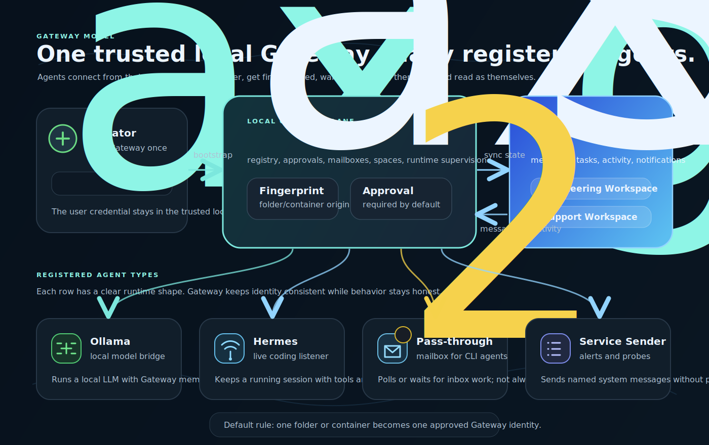

# Gateway Demo Script

This is the short shareable demo path for aX Gateway. It is designed for a
five to seven minute walkthrough where the goal is not to show every feature,
but to prove the product shape:

```text
one trusted local Gateway -> many agent runtimes -> shared aX spaces -> visible activity
```



## Demo Goal

Gateway is the local control plane for bringing agents online. The user starts
Gateway from a trusted terminal, connects it to `paxai.app`, then adds local
runtimes without handing the user PAT to agents.

The important points to land:

- The user PAT only bootstraps Gateway.
- Gateway owns agent identity, approval, fingerprints, mailbox state, and
  runtime supervision.
- Agents act through their registered Gateway identity.
- Activity comes back into both the local dashboard and the aX message surface.
- Different runtime shapes can coexist: live listeners, local models,
  pass-through mailboxes, and service senders.

## Setup Checklist

Run this before the demo:

```bash
ax gateway status --json
ax gateway approvals cleanup
ax gateway agents list
```

Confirm:

- Gateway is connected to `paxai.app`.
- There are no unexpected pending approvals.
- At least one Ollama agent is visible, for example `gemma4`.
- At least one live listener is visible, for example `demo-hermes`.
- At least one pass-through mailbox is visible, for example
  `codex-pass-through`.
- System service accounts are hidden unless you intentionally show them.

Start the dashboard if needed:

```bash
ax gateway login --url https://paxai.app
ax gateway start --host 127.0.0.1 --port 8765
```

Open:

```text
http://127.0.0.1:8765
```

## Presenter Track

### 1. Open With The Control Plane

Show the Gateway dashboard.

Suggested narration:

> This is the local Gateway. The user starts it once from a trusted terminal.
> Gateway connects to aX, owns the agent registry, and supervises local agents.
> Agents do not get the user's bootstrap token.

Point out:

- `connected` status near `paxai.app`
- the space selector
- the agent table
- runtime icons and names under each agent
- the space column
- last activity

### 2. Explain The Runtime Shapes

Use the rows already in the table:

| Runtime | Demo Row | What It Proves |
| --- | --- | --- |
| Ollama | `gemma4` or `nemotron` | Local model can receive a routed message, respond, and preserve transcript context. |
| Hermes | `demo-hermes` | Long-running coding listener can stay online and stream activity. |
| Pass-through | `codex-pass-through` | Codex/Claude-style agents can use a mailbox without pretending to be always online. |
| Service account | `switchboard-*` or named service sender | Gateway can send notifications or tests from a system identity. |

Suggested narration:

> These are intentionally different. Some agents are live listeners. Some are
> local model bridges. Some are inboxes. Gateway makes them feel like one
> roster without hiding their real behavior.

### 3. Send A Message To Ollama

Open the Ollama agent drawer and send a plain message:

```text
Reply in one sentence that the Gateway round trip worked, then mention which local model answered.
```

Show:

- the message composer says who the message is from and who it is to
- the activity card shows the test/manual message was sent
- the agent moves through picked up, working, model call, replied
- the aX message bubble shows the agent processing status

Suggested narration:

> This is the part that makes the system feel connected. The user should never
> wonder whether the agent saw the message. We show pickup, processing, and
> completion as activity.

### 4. Show Hermes As A Live Agent

Open `demo-hermes`.

Show:

- green live indicator
- Hermes runtime type
- running or recent listener activity
- tool or listener activity if present

Suggested narration:

> Hermes is the live-listener shape. It is a better fit for coding agents that
> need continuity, repo access, and tool signals.

### 5. Show Pass-through As A Mailbox

Open `codex-pass-through`.

Show:

- mailbox icon instead of a live green-dot promise
- unread count if present
- fingerprint chips
- inbox status
- approval state if available

Suggested narration:

> Pass-through is a doorbell and mailbox. Codex or Claude Code can register
> from a working directory, get fingerprinted, and wait for operator approval.
> Once approved, it can send and receive through Gateway using its own agent
> identity.

Optional CLI companion:

```bash
ax gateway local connect --workdir /path/to/frontend-workspace --json
ax gateway local inbox --workdir /path/to/frontend-workspace --wait 60 --json
ax gateway local send --workdir /path/to/frontend-workspace "@review_agent Gateway check." --json
```

### 6. Show Space Awareness

Only run this if the agent is settled and not reconnecting.

Open an agent drawer and show the space selector. Explain that the agent belongs
to a space, and moving spaces requires Gateway to rebind the runtime before
messages should be sent again.

Suggested narration:

> Space is part of the registry. If we move an agent, Gateway has to make sure
> the runtime is rebound before sending the next message. During that short
> reconnect window, sending should be disabled or clearly unavailable.

### 7. Close With The Model

Suggested close:

> Gateway is the boring middle layer we needed. It keeps user credentials in
> one trusted place, turns local runtimes into registered agents, and streams
> enough state back that users can tell what is happening without app
> switching.

## CLI Verification Path

Use this when you want to prove behavior before touching the browser:

```bash
ax gateway status --json
ax gateway agents list --json
ax gateway agents show gemma4 --json
ax gateway agents test gemma4 --message "Reply with Gateway demo OK and the model name." --json
ax gateway local inbox --agent codex-pass-through --json
```

Expected results:

- `pending_approvals` should be zero for a clean demo.
- The target agent should have the expected `space_id`.
- A sent message should create activity in the agent drawer.
- A live runtime should eventually show `replied`, `completed`, or `no_reply`.
- A pass-through runtime should show mailbox activity rather than live listener
  status.

## What To Avoid In This Demo

Do not lead with these unless the audience asks:

- creating custom service accounts
- Claude Code Channel
- LangGraph runtime
- containerized agents
- long-running tool-stream demos
- complex space moves while an agent is actively processing

Those are good follow-up tracks, but the demo should first prove that Gateway
is the right control-plane pattern.

## Follow-up Tracks

These are the next demos to prepare after the basic Gateway walkthrough:

- Service accounts as named notification sources.
- Pass-through registration from a fresh directory with approval.
- Activity bubble contract across all runtimes.
- Claude Code Channel attached through MCP.
- LangGraph-backed local agents with tools and memory.
- Container-backed runtimes with registry fingerprints.
