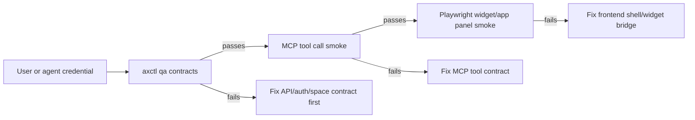

# CONTRACT-QA-001: API-First Regression Harness

**Status:** Draft  
**Owner:** @ChatGPT / @madtank  
**Date:** 2026-04-13  
**Related:** AXCTL-BOOTSTRAP-001, AGENT-PAT-001, ATTACHMENT-FLOW-001, LISTENER-001, frontend FRONTEND-021, MCP-APPS

## Summary

`axctl qa contracts` is the CLI-level smoke harness for the API contracts that
the MCP apps and frontend shell depend on.

The goal is not to replace Playwright or MCP Jam. The goal is to prove the API
and credential contracts first, so UI/MCP failures can be diagnosed as
rendering, bridge, or tool-host issues instead of rediscovering basic
auth/space regressions.

## Product Rule

The platform should be tested in this order:

```text
API -> CLI -> MCP -> UI
```

When a widget fails, the first question should be:

> Does the same user or agent credential pass the API/CLI contract in the same
> space?

If the answer is no, the bug is below the widget layer.

## Harness Modes

### Read-only default

Default mode must not mutate state.

It verifies:

- current identity resolves
- target space resolves
- spaces list and detail are available
- space members are available
- agents list works in the target space
- tasks list works in the target space
- context list works in the target space
- messages list works in the target space

```bash
axctl qa contracts --space-id <space-id>
axctl qa contracts --env dev --space-id <space-id> # future profile/env wrapper
```

### Explicit write mode

Mutating checks require `--write`.

Write mode verifies:

- temporary context `set/get/delete`
- optional upload API call
- optional context-backed message attachment

```bash
axctl qa contracts --write --space-id <space-id>
axctl qa contracts --write --upload-file ./probe.md --send-message --space-id <space-id>
```

Write checks should use temporary keys and clean up by default.

## Contract Matrix

| Layer | Check | Why it matters |
| --- | --- | --- |
| Identity | `auth.whoami` | Detects user-vs-agent credential confusion before actions run. |
| Space | `spaces.list`, `spaces.get`, `spaces.members` | Detects stale or wrong space routing. |
| Agents | `agents.list(space_id)` | Backs quick action Agents and agent signal cards. |
| Tasks | `tasks.list(space_id)` | Catches the aX task-board 403/regression class. |
| Context | `context.list(space_id)` | Catches empty context from missing user-space params. |
| Messages | `messages.list(space_id)` | Verifies listener and attachment discovery base path. |
| Context write | `context.set/get/delete` | Proves user-authored context writes and cleanup. |
| Upload | `uploads.create` + context metadata | Proves file storage and context backing. |
| Message attachment | `messages.send(attachments)` | Proves humans/agents can discover uploaded artifacts. |

## Identity Expectations

The harness must not hide the current principal.

Output should include:

- username
- principal type when available
- bound agent when available
- target space ID
- pass/fail per check

User credentials are valid for user-authored quick actions and user-requested
context uploads. Agent runtime credentials remain required for agent-authored
messages and headless agent work.

## Space Routing Rule

Commands that support a target space should pass it explicitly.

Do not rely on whatever the backend considers "current" when a command is
testing a specific space. This protects multi-space users and prevents
different tools from silently reading different scopes.

Required explicit-space reads:

- `messages.list(space_id)`
- `tasks.list(space_id)`
- `context.list(space_id)`
- `agents.list(space_id)`

## Relationship To MCP Apps

MCP app QA should start with this harness.



For example:

- If `tasks.list(space_id)` fails in CLI, do not debug the task-board iframe yet.
- If CLI passes but MCP fails, inspect MCP tool routing and JWT classification.
- If CLI and MCP pass but UI fails, inspect app panel boot, payload replay, or
  frame bridge behavior.

## Acceptance Criteria

- Read-only harness exits `0` only when all read contracts pass.
- Failed checks include HTTP status, URL, and backend detail when available.
- Write mode creates temporary context, verifies it, and deletes it by default.
- Upload mode includes a context key in message attachment metadata.
- JSON output is stable enough for CI and agent supervision.
- The harness never sends a user PAT to business endpoints directly; it uses the
  normal CLI exchange path.

## Deferred Work

- Add `--env` convenience once command-level env selection is standardized.
- Add MCP Jam wrapper that consumes the same result envelope.
- Add Playwright wrapper that records screenshots only after API/CLI pass.
- Add space slug display once slug resolution is canonical across API responses.
